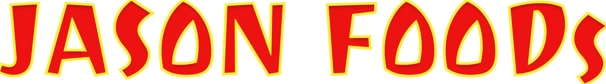

<h1 align="center">Bem vindo ao JASON's Food Front-end 👋</h1>
<p align="center">
 
</p>
<p>
  
  <a href="#" target="_blank">
    
  </a>
</p>

> Repositório destinado a armazenar a o front-end do Jasons food.

## Instalação do Projeto

Antes de executar o projeto é necessário ter instalado:

- ### Obrigatório
  - [Node (melhor utilizar a versão LTS)](https://nodejs.org/en/download/)
  - NPM (se você instalar o node, o npm já vem junto)
- ### Opcionais
  - [Yarn](https://classic.yarnpkg.com/en/docs/install/#mac-stable)
  - [VSCode](https://code.visualstudio.com/Download)

Após instalar os itens acima, é necessário instalar as dependências do projeto. Para isso, rodar no terminal na pasta do projeto:

```sh
# Utilizando yarn
yarn

# Utilizando npm
npm install
```

## Rodando o projeto

```bash
# Utilizando yarn
yarn start

# Utilizando npm
npm run start
```

## Ambientes

- Prod => https://desafio-final-globoacademy-front-end.vercel.app/

## Documentações

## Autores

#### 👤 [João Paulo](https://github.com/paulomarquess)

#### 👤 [Marianna Veras](https://github.com/verasmarianna)

#### 👤 [Samuel Santos](https://github.com/samuelLimaSantos)

#### 👤 [Tais Araujo](https://github.com/taisjjorge)
